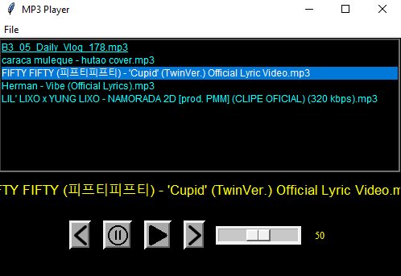

# MP3 Player

Este é um aplicativo de player de MP3 desenvolvido puramente em Python.

## Módulos necessários

Certifique-se de ter os seguintes módulos instalados:

- tkinter
- pygame

Você pode instalá-los usando o pip:

```shell
pip install tkinter pygame
```

# Bibliotecas importadas e usadas

   - tkinter: utilizada para criar a interface gráfica do aplicativo.
   - pygame: utilizada para reproduzir arquivos de áudio.

# Ferramenta utilizada

Este aplicativo foi desenvolvido utilizando o editor de código Visual Studio Code (VS Code). O VS Code é um editor de código-fonte gratuito e leve, disponível para Windows, macOS e Linux. Você pode baixá-lo em https://code.visualstudio.com.
Executando o aplicativo

# Executando o aplicativo

Certifique-se de ter os módulos necessários instalados e execute o arquivo mp3_player.py em um ambiente Python compatível. O aplicativo abrirá uma janela onde você pode selecionar uma pasta contendo arquivos de música MP3 para reproduzir.

Divirta-se ouvindo suas músicas favoritas!


-----------------------------------------------
Current Version Mp3 Player screenshoot


